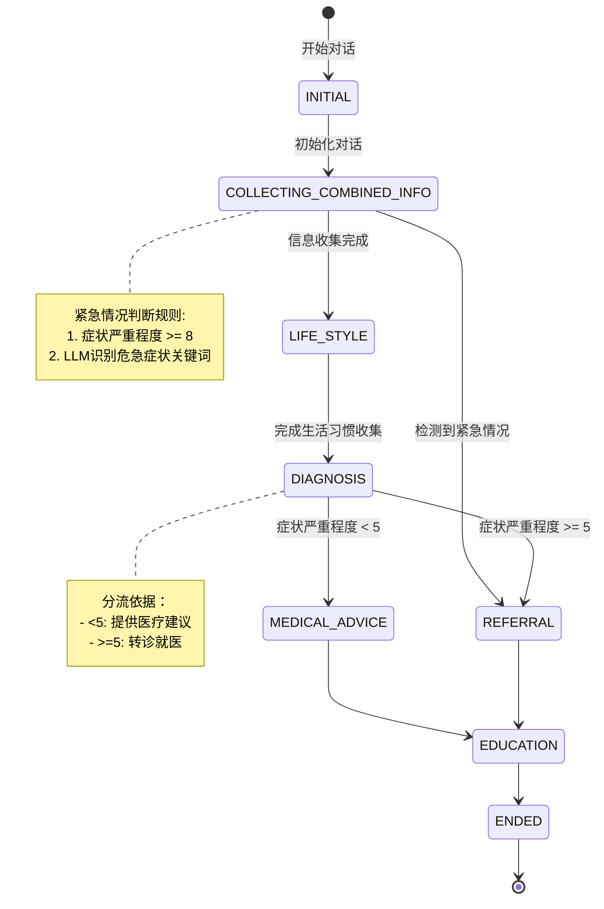

# 医疗问答大模型系统2.1

2.1版本基于LLM的医疗问答系统，集成知识库检索增强生成(RAG)功能，并新增完整的对话管理流程，优化多轮对话效果

## 功能特点
- 完整的问诊流程管理
- 智能紧急情况识别
- 基础信息系统性收集
- 症状分析和风险评估
- 分级转诊建议
- 健康教育知识普及
- 知识库检索增强
- 多轮对话效果优化

## 2.1 新增特性：RAGFlow知识库集成
本版本完成了与RAGFlow知识检索服务的深度集成，相较于2.0版本的本地知识库，提供了更优的医疗领域检索和问答能力。

### RAGFlow技术参数

- 医学元数据标注：针对医学教材进行了专业的元数据标注，支持基于科室、疾病类型等多维度的精准检索
- 分层医学知识索引：实现了从医学概念到具体临床案例的分层知识索引架构，更符合医学知识组织特点
- 语义分块：采用BGE嵌入模型进行医学文本的语义表示，保证了医学概念的完整性和连贯性
- 重排序模型：利用Gte@qainwen 重排序模型对检索结果进行精细排序，大幅提升检索精度
- 混合检索策略：结合向量相似度和重排序评分的混合检索策略，通过相似度阈值过滤低质量结果

### 知识库集成架构
```
对话管理器 --> 知识库工厂 --> 选择知识库实现
                |                 |
                v                 v
          本地FAISS向量存储     RAGFlow API
                |
                v
          本地医疗数据
```

## 2.1 系统结构
    medical_LLM_system/
    ├── src/
    │   ├── dialogue/           # 对话管理系统
    │   │   ├── manager.py     # 对话管理器
    │   │   ├── flows.py       # 对话流程实现
    │   │   ├── states.py      # 状态定义
    │   │   ├── utils.py       # 工具函数
    │   │   └── field_mappings.py  # 新增：字段映射定义
    │   ├── knowledge/         # 知识库管理
    │   │   ├── kb.py          # 知识库实现
    │   │   ├── ragflow_kb.py  # 新增：RAGFlow知识库实现
    │   │   ├── factory.py     # 新增：知识库工厂类
    │   │   └── vector_store.py # 新增：向量存储实现
    │   ├── config/            # 新增：配置管理
    │   │   ├── loader.py      # 配置加载器
    │   │   ├── states.json    # 状态配置
    │   │   └── field_mappings.json # 字段映射配置
    │   ├── llm/              # LLM接口
    │   │   └── api.py         # API实现
    │   └── prompts/          # 提示词配置
    │       └── medical_prompts.py
    ├── data/
    │   ├── knowledge_base/    # 医疗知识源数据
    │   └── vector_store/      # 向量数据
    ├── examples/             # 示例代码
    │   ├── main.py           # 主程序示例
    │   └── test_llm_flow.py   # 新增：LLM流程测试
    └── test/                 # 测试

## 系统运行逻辑

### 1. 知识库初始化
系统启动时通过init_knowledge_base()函数初始化知识库:
- 若指定使用RAGFlow，则连接RAGFlow API服务
- 若使用本地知识库且存在已保存的向量索引，直接加载
- 否则从数据源构建新的向量索引并保存

### 2. 问答处理流程

#### 2.1 对话状态流转
系统实现了完整的问诊流程状态机，流程图如下：



系统各状态说明：

1. 初始状态(INITIAL)
   - 系统启动，准备开始对话
   - 自动转换到综合信息收集状态
   
2. 综合信息收集状态 (COLLECTING_COMBINED_INFO)
   - 智能化信息收集阶段，LLM动态引导收集信息的优先级顺序：

     1. 主要症状（最高优先级）
     2. 症状持续时间
     3. 症状严重程度
     4. 基本信息（年龄、性别）
     5. 额外症状细节

   - 特殊判断机制

     - 实时检测紧急情况 如症状严重程度 >= 8 或 LLM识别到危急症状，直接转入转诊流程

   信息收集完成后进入生活方式收集

3. 生活方式收集 (LIFE_STYLE)
   - 收集用户生活习惯信息：
     - 睡眠情况
     - 饮食习惯
     - 运动情况
     - 工作压力
     - 烟酒习惯

4. 诊断分析 (DIAGNOSIS)
   - 根据收集的信息进行初步诊断
   - 评估症状严重程度
   - 决定后续流程

   - 分流规则：症状严重程度 < 5：进入医疗建议流程， 症状严重程度 >= 5：进入转诊流程

5. 医疗建议 (MEDICAL_ADVICE)
   - 为轻症患者提供： 用药建议， 生活调整方案， 自我观察指导

6. 转诊建议 (REFERRAL)
   - 为需要及时就医的患者提供： 就医科室建议 ，就医等级 ，紧急程度说明 ，就医注意事项

7. 健康教育 (EDUCATION)
   - 相关疾病知识普及
   - 预防建议
   - 日常健康管理指导

8. 结束状态 (ENDED)


#### 2.2 信息收集和处理
- 每个状态都有对应的Flow类管理信息收集
- 系统按需获取必要信息，避免冗余提问
- 实时检测紧急情况并及时处理
- 结合知识库提供专业建议

#### 2.3 回复生成
系统使用模板化提示词，根据不同状态生成对应回复：
- 诊断模板：分析症状、评估风险
- 医疗建议模板：用药建议、生活调整
- 转诊模板：就医建议、科室推荐
- 健康教育模板：知识普及、预防建议

#### 2.4 多轮对话限制
- 多轮对话伦次和时间设计限制在config.py(未上传)中，保证对话流在合理范围内结束

## 安装依赖
    pip install -r requirements.txt

主要依赖：
- deepseek R1 #LLM api接口
- faiss-cpu/ Ragflow #向量数据存储
- sentence-transformers/ BGE #embedding模型
- langchain / Ragflow #知识库管理
- pandas #数据处理

## 使用方法
```python
from examples.main import init_system

def main(use_ragflow=False):
    # 初始化系统，可选是否使用RAGFlow知识库
    manager = init_system(use_ragflow=use_ragflow)
    
    # 可以通过set_use_llm_flow控制是否使用LLM驱动的流程
    manager.set_use_llm_flow(True)  # 默认开启
    
    print("医疗助手: 您好,我是您的医疗助手。有什么可以帮您？")
    
    # 多轮对话
    while True:
        user_input = input("患者: ").strip()
        if user_input.lower() in ['退出', 'quit', 'exit']:
            break
            
        response = manager.process_message(user_input)
        print(f"医疗助手: {response}")
        
        # 对话结束检查
        if manager.context.state.value == 'ended':
            print("\n对话结束,感谢您的使用\n")
            break

if __name__ == "__main__":
    import argparse
    parser = argparse.ArgumentParser(description='医疗问答系统')
    parser.add_argument('--ragflow', action='store_true', help='使用RAGFlow知识库')
    args = parser.parse_args()
    
    main(use_ragflow=args.ragflow)
```

## 2.0 数据集
采用多源医疗数据：
1. 基础问答数据
   - 来源：开源中文医疗问答数据集
   - 数量：内科sample 7644条QA问答
2. 医学教材知识 
3. 多轮问答语料 (Claude  Sonnet 3.7生成)

基础问答数据格式示例：

| department	| title | question | answer |
|------------|-------|-----------|---------|
| 内科 | 头痛症状 | 我最近经常头痛，该怎么办？ | 建议您首先记录头痛的具体表现... |

## 测试结果

### 常规诊断建议测试（给出诊断分析，医疗建议，和健康教育）
```
医疗助手: 您好，我是您的医疗助手。请问您有什么不舒服的地方吗？
患者: 我这两天胃不太舒服
医疗助手: 除了胃不舒服，您还有其他伴随的症状吗？比如恶心、呕吐或者腹泻？
患者: 没什么特别的，就是这两天感觉有点累，可能是因为胃不舒服，晚上睡眠也不是很好。偶尔会觉得有点反酸，但不是很明显。
医疗助手: 请问您的年龄是多少？
患者: 我今年35了，马上要36了，属猪的。
医疗助手: 您的胃部不适是持续性的还是间歇性的？有没有伴随烧心或反酸的感觉？
患者: 嗯，不是一直都疼，主要是吃完饭后会难受一会儿，饿的时候反而好一些。有时候晚上睡觉前也会有点不舒服。
医疗助手: 请问您的性别是？
患者: 女的，我是女的。
医疗助手: 请问您目前正在服用哪些药物或补充剂？
患者: 最近没吃什么药，就前两天胃疼了，自己去药店买了点胃舒平，吃了一天。
医疗助手: 请问您过去是否有过胃溃疡、胃炎或其他消化系统疾病的病史呢？
患者: 我啊，之前身体还不错，没有什么大病，就是有点轻微的甲状腺问题，医生说是亚健康，也没怎么吃药。哦对了，十年前做过一个阑尾炎手术，不是很大的手术。
医疗助手: 请问您是否有药物或食物过敏史？
患者: 青霉素过敏，吃了会起疹子，挺难受的。还有海鲜不能吃太多，吃多了也容易过敏。
医疗助手: 您能具体描述一下胃不舒服的感觉吗？比如是隐痛、灼烧感还是胀闷感？
患者: 就是这里，胃这个位置，吃东西的时候有点隐隐作痛，不是很剧烈，但挺不舒服的，有时候还会胀胀的。
医疗助手: 您最近的饮食规律吗？比如有没有经常吃辛辣、油腻的食物，或者经常外出就餐？
患者: 说实话，我饮食不太规律，工作忙起来经常忘记吃饭，有时候中午就随便吃个快餐，晚上回家太晚了，也懒得做饭，就点个外卖，经常吃些烧烤啊火锅啊这些。平时也爱喝咖啡，提提神。
医疗助手: 您平时有吸烟或饮酒的习惯吗？如果有的话，大概的频率是怎样的呢？
患者: 我不抽烟，但偶尔会喝点酒，特别是和客户应酬的时候，一周可能有一两次吧，不过不会喝很多。
医疗助手: 您最近的睡眠情况怎么样？比如每天睡几个小时，有没有入睡困难或者多梦的情况？
患者: 最近睡得不太好，工作比较忙，通常半夜12点多才睡，早上7点就得起，大概六个小时吧。有时候半夜会醒一下，可能是胃不舒服的原因。
医疗助手: 您平时有没有规律运动的习惯？比如每周会做些跑步、游泳之类的锻炼吗？
患者: 平时挺少运动的，主要是没什么时间。偶尔周末会去公园走走，但是很不规律，最近一个月好像都没怎么运动了。
医疗助手: [开始诊断分析] 症状详细分析 患者以餐后胃部不适为主诉，症状在进食后加重、空腹时缓解，且夜间睡前加重，符合消化性溃疡（尤其是十二指肠溃疡）的典型疼痛节律。结合以下特点：...
患者: 继续
医疗助手: [开始医疗建议] 用药注意事项和药物相互作用 - 胃舒平（铝碳酸镁）需餐后1-2小时或睡前嚼服，避免与以下药物同服：...
患者: 继续
医疗助手: [开始健康教育] 一、预防和保健建议 1. 饮食调整：规律进食：每日定时定量进餐，避免过饥过饱，可采用"少量多餐"（每餐5-7分饱，每日4-5餐）...
患者: 继续
医疗助手: [给出最终建议] 根据您描述的餐后胃胀、食欲下降、口气重等症状，结合医学知识库信息为您整理以下指导建议：【日常调养指南】 1. 饮食可尝试"三三原则"：每餐吃三成饱，每日分三次加餐（如上午10点、下午3点、睡前1小时）...

对话结束,感谢您的使用
```

### 紧急情况测试 （收集症状阶段识别紧急情况，直接进入转诊建议）
```
医疗助手: 您好，我是您的医疗助手。请问您有什么不舒服的地方吗？

患者: 我朋友倒地抽搐，口吐白沫

医疗助手: [系统识别为紧急情况]

就医建议：非紧急但需及时就诊（症状严重程度较高，建议3天内就医）
建议就诊科室：神经内科（三级医院）或癫痫专科门诊
就医等级：三级医院（可进行视频脑电图监测、核磁共振等精密检查）
就医前准备：


记录发作具体细节：发作时长、诱发因素、发作频率
准备手机拍摄发作视频（如有条件）
携带既往就诊资料及正在服用的药物清单
穿着宽松衣物便于检查
有家属陪同就诊


注意事项：
① 发作防护：


避免从事驾驶、高空作业、游泳等高风险活动
发作时保持侧卧位防止误吸
移除周围尖锐物品保护头部
记录每次发作的具体时间及表现

② 生活管理：

保证7-8小时规律睡眠
避免咖啡因、酒精及闪光刺激
控制手机/电脑使用时间（每天不超过4小时）
维持稳定情绪，避免过度疲劳

③ 诊疗配合：

即使未再发作也要按医嘱复查（每3-6个月）
检查前需保持头皮清洁（脑电图检查要求）
可能需要72小时动态脑电图监测
治疗药物需严格遵医嘱调整剂量

建议：70%的癫痫患者通过规范治疗可实现无发作，建议尽早就诊三级医院神经内科。目前国际指南推荐的新型抗癫痫药物有效率可达85%，切勿因既往治疗效果欠佳而放弃治疗。

患者: 继续

医疗助手: 关于癫痫的预防、保健及日常管理，请您注意以下信息：

预防与保健建议：


保持规律作息，避免熬夜或过度疲劳
饮食均衡，限制咖啡、浓茶、酒精等刺激性饮品
保持情绪稳定，避免强烈精神刺激
预防头部外伤（如骑车戴头盔）
严格遵医嘱用药，不可自行增减药量或停药


需要警惕的紧急情况：
❗若出现以下情况请立即就医：


单次发作持续超过5分钟
短时间内多次发作(发作间歇期意识未恢复)
发作后出现呼吸困难/发绀
发作期间造成严重外伤


日常自我监测要点：


记录发作日志：日期、持续时间、发作表现
观察发作前是否有预兆(如特殊气味、闪光感)
注意药物副作用：定期复查肝肾功能
监测体温变化(发热可能诱发发作)


重要健康知识：


约70%患者通过规范用药可控制发作
突然停药是诱发癫痫持续状态最常见原因
女性患者备孕前需与医生沟通调整用药
驾驶、游泳等高风险活动需严格遵医嘱

建议每3-6个月到神经内科复诊，通过脑电图和血药浓度检测评估治疗效果。家属应学习发作时的正确处理方法：保持呼吸道通畅、移开危险物品、记录发作表现，切勿强行按压肢体或塞物品入口。

对话结束,感谢您的使用
```

### 超时测试（给出诊断分析，转诊建议，和健康教育）
```
医疗助手： 您好,我是您的医疗助手。有什么可以帮您？
患者: 你好
医疗助手: 对话时间已超时,建议重新开始咨询。

对话结束,感谢您的使用
```

## 未来优化方向
1. 知识库扩充: 扩展专业医疗文献 增加临床案例数据 更新最新医学研究成果 
2. 对话优化: 提升多轮对话准确性 优化问诊路径 增强个性化建议能力 
3. 功能拓展: 添加语音交互功能 支持图片识别功能 接入医疗资源导航
