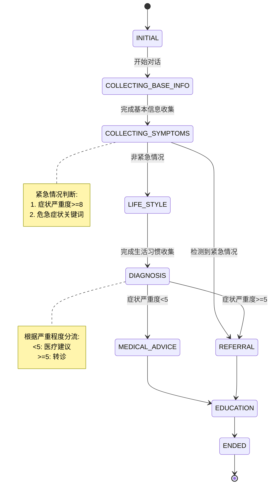

# 医疗问答大模型系统2.0

2.0版本基于LLM的医疗问答系统，集成知识库检索增强生成(RAG)功能，并新增完整的对话管理流程

## 功能特点
- 完整的问诊流程管理
- 智能紧急情况识别
- 基础信息系统性收集
- 症状分析和风险评估
- 分级转诊建议
- 健康教育知识普及
- 知识库检索增强
- 多轮对话支持

## 2.0 系统结构
    medical_LLM_system/
    ├── src/
    │   ├── dialogue/           # 对话管理系统
    │   │   ├── manager.py     # 对话管理器
    │   │   ├── flows.py       # 对话流程实现
    │   │   ├── states.py      # 状态定义
    │   │   └── utils.py       # 工具函数
    │   ├── knowledge/         # 知识库管理
    │   │   └── kb.py          # 知识库实现
    │   ├── llm/              # LLM接口
    │   │   └── api.py         # API实现
    │   └── prompts/          # 提示词配置
    │       └── medical_prompts.py
    ├── data/
    │   ├── knowledge_base/    # 医疗知识源数据
    │   └── vector_store/      # 向量数据
    ├── examples/             # 示例代码
    │   └── main.py           # 主程序示例
    └── test/                 # 测试

## 系统运行逻辑

### 1. 知识库初始化
系统启动时通过init_knowledge_base()函数初始化知识库:
- 若存在已保存的向量索引,直接加载
- 否则从数据源构建新的向量索引并保存

### 2. 问答处理流程

#### 2.1 对话状态流转
系统实现了完整的问诊流程状态机，流程图如下：



系统各状态说明：

1. 初始状态(INITIAL)
2. 基本信息收集(COLLECTING_BASE_INFO)
   - 收集年龄、性别、病史等基本信息
3. 症状信息收集(COLLECTING_SYMPTOMS)
   - 收集主要症状、持续时间、严重程度等
   - **紧急情况判断**：若检测到紧急情况，直接转入转诊流程
4. 生活习惯调查(LIFE_STYLE)
   - 收集作息、饮食、运动等生活习惯
5. 诊断分析(DIAGNOSIS)
   - 基于症状严重程度决定后续流程：
     - 严重程度>=5：转入转诊流程
     - 严重程度<5：转入医疗建议
6. 医疗建议(MEDICAL_ADVICE)
   - 提供用药建议和生活调整方案
7. 转诊建议(REFERRAL)
   - 提供就医科室、等级和注意事项
8. 健康教育(EDUCATION)
   - 提供相关健康知识普及
9. 结束状态(ENDED)

#### 2.2 信息收集和处理
- 每个状态都有对应的Flow类管理信息收集
- 系统按需获取必要信息，避免冗余提问
- 实时检测紧急情况并及时处理
- 结合知识库提供专业建议

#### 2.3 回复生成
系统使用模板化提示词，根据不同状态生成对应回复：
- 诊断模板：分析症状、评估风险
- 医疗建议模板：用药建议、生活调整
- 转诊模板：就医建议、科室推荐
- 健康教育模板：知识普及、预防建议

## 安装依赖
    pip install -r requirements.txt

主要依赖：
- openai #LLM接口
- faiss-cpu #向量数据存储
- sentence-transformers #embedding模型
- langchain #知识库管理
- pandas #数据处理

## 使用方法
```python
from examples.main import init_system

def main():
    # 初始化系统
    manager = init_system()
    print("医疗助手: 您好,我是您的医疗助手。我将按逐步指引您完成问诊流程，接下来会询问您一些基本信息，请回复“开始”（或除“退出”外任何词汇）进行咨询，回复“退出”将离开本次咨询")
    
    # 多轮对话
    while True:
        user_input = input("患者: ").strip()
        if user_input.lower() in ['退出', 'quit', 'exit']:
            break
            
        response = manager.process_message(user_input)
        print(f"医疗助手: {response}")
        
        # 对话结束检查
        if manager.context.state.value == 'ended':
            print("\n对话结束,感谢您的使用\n")
            break

if __name__ == "__main__":
    main()
```

## 2.0 数据集
采用多源医疗数据：
1. 基础问答数据
   - 来源：开源中文医疗问答数据集
   - 数量：内科sample 7644条QA问答
2. 医学教材知识 #暂无
3. 多轮问答语料 #暂无

数据格式示例：

| department	| title | question | answer |
|------------|-------|-----------|---------|
| 内科 | 头痛症状 | 我最近经常头痛，该怎么办？ | 建议您首先记录头痛的具体表现... |

## 测试结果

### 基础信息收集测试
```
医疗助手: 您好，我是您的医疗助手。接下来我会问您一些基本信息，请问您今年多大年纪了？
患者: 35岁
医疗助手: 请问您的性别是男士还是女士？
患者: 男
医疗助手: 您之前有没有得过什么病或者动过手术？
```

### 症状收集测试
```
医疗助手: 能具体说说您哪里不舒服吗？
患者: 最近经常头痛
医疗助手: 这种不舒服大概有多久了？
患者: 一周了
医疗助手: 这种不适对您的影响有多大?(1分最轻,10分最重)
```

### 紧急情况测试
```
患者: 我胸口剧烈疼痛，感觉喘不上气
医疗助手: 您描述的症状可能涉及紧急情况，建议：
1. 立即前往最近的急诊科就医
2. 建议就医科室：心内科/急诊科
3. 建议就医等级：三级医院
4. 就医前准备：
   - 带好身份证和医保卡
   - 如有既往病历请携带
   ...
```

### 常规诊断建议测试
```
医疗助手: 根据您的症状描述和各项信息，初步分析：
1. 症状分析：
   - 头痛位置：双侧太阳穴
   - 性质：胀痛
   - 诱因：疲劳、压力
2. 可能的病因：
   - 紧张性头痛
   - 疲劳性头痛
3. 建议：
   - 建议到神经内科就诊
   - 注意休息，避免过度疲劳
   ...
```

## 未来优化方向
1. 扩充知识库覆盖范围
2. 优化紧急情况识别准确率
3. 增强多轮对话上下文理解
4. 完善专科问题处理能力
5. 提升建议个性化程度
