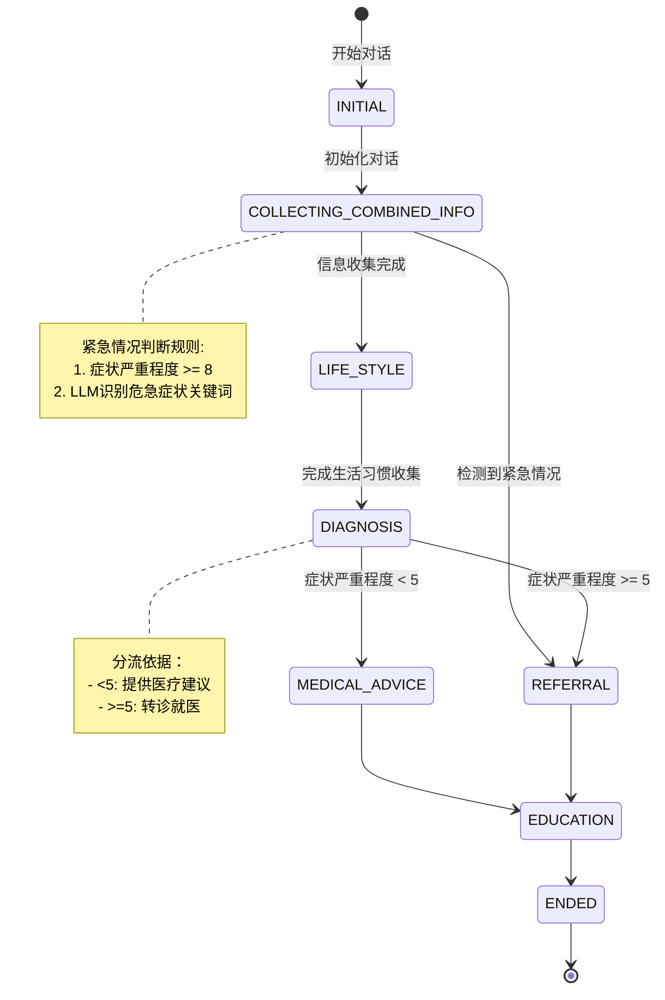
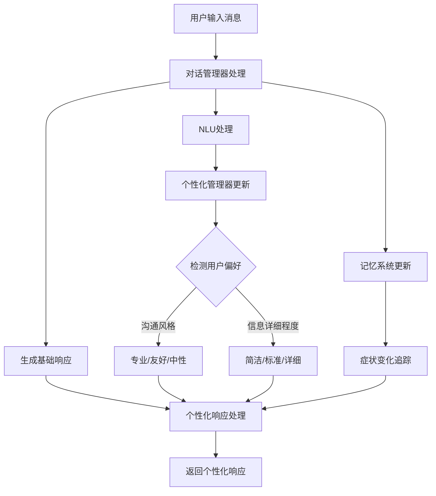

# 医疗问答大模型系统3.0

3.0版本基于LLM的医疗问答系统，重点优化**多轮对话效果**，新增分层记忆架构、增强型NLU和个性化交互系统，提供更智能、更人性化的医疗咨询体验。

## 功能特点
- 完整的问诊流程管理
- 智能紧急情况识别
- 基础信息系统性收集
- 症状分析和风险评估
- 分级转诊建议
- 健康教育知识普及
- 知识库检索增强
- **多轮对话优化**
- **分层记忆架构**（短期/中期/长期记忆）
- **增强型NLU系统**（实体识别、意图检测、上下文分析）
- **个性化交互系统**（基于用户画像的差异化交互）

## 3.0 核心升级亮点

    | 维度 | 2.0版本 | 3.0版本 |
    | ---- | ------- | ------- |
    | 上下文处理 | 单轮状态存储 | 分层记忆架构（短期/中期/长期记忆） |
    | 个性化 | 标准化建议 | 基于用户画像的差异化交互 |
    | 症状识别 | 描述症状实体提取 | 增强型描述性症状实体提取 |
    | 对话能力 | 固定流程问询 | 自动关联上下文生成交叉问询 |

## 系统结构
    medical_LLM_system/
    ├── src/
    │   ├── dialogue/           # 对话管理系统
    │   │   ├── manager.py      # 对话管理器 (3.0：集成短中长期记忆，NLU，个性化模块)
    │   │   ├── flows.py        # 对话流程实现
    │   │   ├── states.py       # 状态定义
    │   │   ├── utils.py        # 工具函数
    │   │   └── field_mappings.py  # 字段映射定义
    │   ├── knowledge/          # 知识库管理
    │   │   ├── kb.py           # 知识库实现
    │   │   ├── ragflow_kb.py   # RAGFlow知识库实现
    │   │   ├── factory.py      # 知识库工厂类
    │   │   └── vector_store.py # 向量存储实现
    │   ├── memory/             # 3.0：记忆系统
    │   │   ├── short_term.py   # 短期记忆
    │   │   ├── mid_term.py     # 中期记忆
    │   │   ├── long_term.py    # 长期记忆
    │   │   └── manager.py      # 记忆管理器
    │   ├── personalization/    # 3.0：个性化系统
    │   │   ├── user_profile.py        # 用户画像
    │   │   ├── preference_detector.py # 偏好检测器 
    │   │   ├── response_generator.py  # 响应生成器
    │   │   └── manager.py             # 个性化管理器
    │   ├── nlu/                # 3.0：自然语言理解模块
    │   │   ├── entity_recognition.py  # 实体识别
    │   │   ├── intent_detection.py    # 意图检测
    │   │   └── context_analyzer.py    # 上下文分析器
    │   ├── config/             # 配置管理
    │   │   ├── loader.py       # 配置加载器 
    │   │   ├── states.json     # 状态配置
    │   │   └── field_mappings.json # 字段映射配置
    │   ├── llm/                # LLM接口
    │   │   └── api.py          # API实现
    │   ├── prompts/            # 提示词配置
    │   │   └── medical_prompts.py
    │   ├── auth/               # 用户认证
    │   │   ├── user_manager.py  # 用户管理
    │   │   └── session_manager.py # 会话管理
    │   └── app_config.py       # 应用配置
    ├── data/
    │   ├── knowledge_base/     # 医疗知识源数据
    │   ├── vector_store/       # 向量数据
    │   └── profiles/           # 3.0：用户画像存储
    └── examples/
        ├── main.py             # 主程序示例
        └── test_llm_flow.py    # LLM流程测试
    

## 新增功能详解

### 1. 分层记忆架构
系统实现了三层记忆架构，使对话系统具备"记忆"能力：
- 短期记忆：存储当前会话的对话历史、提取的症状、临时诊断结果
- 中期记忆：保存近期就诊记录、处方历史，可在后续就诊中被检索和引用
- 长期记忆：存储患者档案和病史，使用向量数据库实现语义相似度检索
记忆管理器（MemoryManager）协调三层记忆之间的信息流转，支持主动检索和使用历史信息。

### 2. 增强型NLU组件
升级的NLU组件包含以下关键功能：

- 实体识别：提升症状描述识别准确率，支持复杂描述性文本分析
- 意图检测：识别用户交互意图（咨询、紧急求助、报告症状等）
- 上下文分析：分析消息与对话上下文的关系，检测信息矛盾
- 症状交叉引用：将新提及的症状与历史症状进行关联和比较

### 3. 个性化交互系统
全新的个性化系统包含多个组件：
- 用户画像：存储用户基本信息、医疗历史、症状记录和交互偏好
- 偏好检测：从对话中识别用户的沟通风格和信息详细程度偏好
- 个性化响应：根据用户偏好调整回复风格和内容
- 症状追踪：比较症状变化，提供针对性反馈（"您的头痛症状相比上次有所改善"）

## 系统逻辑
系统实现了完整的问诊流程状态机，流程图如下：



系统各状态说明：

1. 初始状态(INITIAL)
   - 系统启动，准备开始对话
   - 自动转换到综合信息收集状态
   
2. 综合信息收集状态 (COLLECTING_COMBINED_INFO)
   - 智能化信息收集阶段，LLM动态引导收集信息的优先级顺序：

     1. 主要症状（最高优先级）
     2. 症状持续时间
     3. 症状严重程度
     4. 基本信息（年龄、性别）
     5. 额外症状细节

   - 特殊判断机制

     - 实时检测紧急情况 如症状严重程度 >= 8 或 LLM识别到危急症状，直接转入转诊流程

   信息收集完成后进入生活方式收集

3. 生活方式收集 (LIFE_STYLE)
   - 收集用户生活习惯信息：
     - 睡眠情况
     - 饮食习惯
     - 运动情况
     - 工作压力
     - 烟酒习惯

4. 诊断分析 (DIAGNOSIS)
   - 根据收集的信息进行初步诊断
   - 评估症状严重程度
   - 决定后续流程

   - 分流规则：症状严重程度 < 5：进入医疗建议流程， 症状严重程度 >= 5：进入转诊流程

5. 医疗建议 (MEDICAL_ADVICE)
   - 为轻症患者提供： 用药建议， 生活调整方案， 自我观察指导

6. 转诊建议 (REFERRAL)
   - 为需要及时就医的患者提供： 就医科室建议 ，就医等级 ，紧急程度说明 ，就医注意事项

7. 健康教育 (EDUCATION)
   - 相关疾病知识普及
   - 预防建议
   - 日常健康管理指导

8. 结束状态 (ENDED)

### 3.0版本新增功能处理流程


### 记忆系统架构
短期记忆存储格式（内存字典）：
```
{
  "current_dialogue": [
    {"role": "patient", "content": "我最近头痛", "timestamp": "2023-10-01 14:30:22"},
    {"role": "doctor", "content": "头痛持续多久了？", "timestamp": "2023-10-01 14:30:45"}
  ],
  "current_symptoms": [
    {"name": "头痛", "location": "额头", "severity": "中度", "first_mentioned": "2023-10-01 14:30:22"},
    {"name": "眩晕", "pattern": "起立时加重", "first_mentioned": "2023-10-01 14:32:10"}
  ],
  "temp_diagnosis": "可能是偏头痛",
  "entity_mentions": {
    "symptom": {
      "头痛": [{"context": "我最近头痛", "timestamp": "2023-10-01 14:30:22"}]
    }
  },
  "context_info": {
    "past_symptoms": ["发热", "咳嗽"],
    "past_diagnoses": ["上呼吸道感染"]
  }
}
```
中期记忆存储格式（Redis）：
```
KEY: medical_mid_term:patient:{patient_id}
VALUE: {"name": "张三", "age": "45", "gender": "男"}

KEY: medical_mid_term:consultation:{patient_id}:{consultation_id}
VALUE: {
  "timestamp": "2023-10-01 15:00:00",
  "dialogue": [...对话历史...],
  "symptoms": [...症状列表...],
  "diagnosis": "偏头痛"
}

KEY: medical_mid_term:consultation_index:{patient_id}
VALUE: SET ["consultation_20231001_123", "consultation_20231005_456"]

KEY: medical_mid_term:prescription:{patient_id}:{prescription_id}
VALUE: {
  "timestamp": "2023-10-01 15:30:00",
  "medication": "布洛芬",
  "dosage": "400mg",
  "frequency": "每8小时一次",
  "duration": "3天"
}
```
长期记忆存储格式（Ragflow chunk）：
```
{
  "id": "profile_{patient_id}",
  "text": "{\"name\":\"张三\",\"age\":\"45\",\"gender\":\"男\",\"allergies\":[\"青霉素\"]}",
  "metadata": {
    "patient_id": "patient_001",
    "type": "profile",
    "timestamp": "2023-09-30T10:15:30"
  },
  "embedding": [0.1, 0.2, 0.3, ...]
}

{
  "id": "history_{patient_id}_{timestamp}",
  "text": "{\"symptoms\":[\"头痛\",\"眩晕\"],\"diagnosis\":\"偏头痛\",\"notes\":\"长期反复发作\"}",
  "metadata": {
    "patient_id": "patient_001",
    "type": "medical_history",
    "timestamp": "2023-10-01T15:00:00"
  },
  "embedding": [0.4, 0.5, 0.6, ...]
}
```
用户画像储存格式（Json 文件）：
```
{
  "user_id": "patient_001",
  "basic_info": {
    "name": "张三",
    "age": "45",
    "gender": "男",
    "occupation": "软件工程师"
  },
  "medical_history": {
    "diseases": ["高血压", "胆囊炎"],
    "allergies": ["青霉素", "海鲜"],
    "surgeries": ["胆囊切除术(2018年)"]
  },
  "symptom_entities": {
    "头痛": {
      "location": "额头",
      "pattern": "间歇性",
      "severity": "中度",
      "duration": "反复发作3年",
      "first_mentioned": "2023-10-01 14:30:22"
    },
    "眩晕": {
      "severity": "轻度",
      "pattern": "起立时加重",
      "duration": "近1个月",
      "first_mentioned": "2023-10-01 14:32:10"
    }
  },
  "preferences": {
    "communication_style": "professional",
    "detail_level": "detailed"
  },
  "last_update": "2023-10-01 15:45:30"
}
```
## 安装依赖
    pip install -r requirements.txt

主要依赖：
- deepseek R1 #LLM api接口
- faiss-cpu/ Ragflow #向量数据存储
- sentence-transformers/ BGE #embedding模型
- langchain / Ragflow #知识库管理
- pandas #数据处理

## 使用方法
```python
from examples.main import init_system

def main(use_ragflow=False):
    # 初始化系统，可选是否使用RAGFlow知识库
    manager = init_system(use_ragflow=use_ragflow)
    
    # 可以通过set_use_llm_flow控制是否使用LLM驱动的流程
    manager.set_use_llm_flow(True)  # 默认开启
    
    print("医疗助手: 您好,我是您的医疗助手。有什么可以帮您？")
    
    # 多轮对话
    while True:
        user_input = input("患者: ").strip()
        if user_input.lower() in ['退出', 'quit', 'exit']:
            break
            
        response = manager.process_message(user_input)
        print(f"医疗助手: {response}")
        
        # 对话结束检查
        if manager.context.state.value == 'ended':
            print("\n对话结束,感谢您的使用\n")
            break

if __name__ == "__main__":
    import argparse
    parser = argparse.ArgumentParser(description='医疗问答系统')
    parser.add_argument('--ragflow', action='store_true', help='使用RAGFlow知识库')
    args = parser.parse_args()
    
    main(use_ragflow=args.ragflow)
```

## 数据集
采用多源医疗数据：
1. 基础问答数据
   - 来源：开源中文医疗问答数据集
   - 数量：28000 条QA问答
2. 医学教材知识 （23 本中文教材）
3. 多轮问答语料 (Claude  Sonnet 3.7生成120条多轮问答)

基础问答数据格式示例：

    | department	| title | question | answer |
    |------------|-------|-----------|---------|
    | 内科 | 头痛症状 | 我最近经常头痛，该怎么办？ | 建议您首先记录头痛的具体表现... |

多轮问答示例
```
科室标签
耳鼻喉科
关键词
慢性鼻炎、慢性鼻窦炎、鼻塞、鼻涕、头痛、感染、鼻腔冲洗、抗生素、鼻内窥镜手术、鼻息肉
检索问题

慢性鼻炎和慢性鼻窦炎有什么区别？
慢性鼻炎需要手术治疗吗？
慢性鼻炎反复发作的原因是什么？
鼻腔冲洗对慢性鼻炎有效吗？
长期使用鼻腔喷雾剂安全吗？
慢性鼻炎会引起其他并发症吗？


初诊（耳鼻喉科门诊）
医生：李先生，您好，我是张医生。请问您有什么不舒服？
患者（45岁，男性）：（声音有些鼻音）医生，我这鼻子堵得厉害，有好几年了。鼻涕又黄又浓，有时候还带血丝。早上起来第一件事就是使劲擤鼻涕，不弄出来就难受。最近还经常头疼，特别是眉心和鼻根这一带。
医生：您这些症状持续多久了？有没有什么因素会让症状加重，比如季节变化或者感冒后？
患者：断断续续有五六年了吧。一开始以为就是普通感冒，吃点药就好了，但老是反复。每次感冒后症状就会加重，好不容易才能缓解一点，但从来没完全好过。对了，冬天好像会严重一些。（突然问道）医生，我这是不是鼻窦炎啊？我在网上查了症状，挺像的。
医生：从您描述的症状来看，确实符合慢性鼻窦炎的表现。慢性鼻窦炎是指鼻窦黏膜的长期炎症，常表现为鼻塞、浓涕、面部疼痛或压迫感等症状。慢性鼻炎和慢性鼻窦炎常常同时存在，因为鼻腔和鼻窦是相连的。您平时还有其他症状吗，比如嗅觉减退或者咳嗽，尤其是晚上躺下后的咳嗽？
患者：（思考片刻）嗯，好像是有点闻不太到味道，但不是特别明显。咳嗽倒是有，尤其是早上起来，感觉有痰从鼻子后面往下流，咳出来的痰和鼻涕差不多。（转向其他话题）医生，我前年看过一次，那个医生说是鼻甲肥大，让我做个手术。但我一听说手术就害怕，所以一直没去。这次非得做手术吗？
医生：不一定需要手术，这要根据您的具体情况来决定。后鼻滴流感和晨起咳嗽也是慢性鼻窦炎的常见表现。我需要检查一下您的鼻腔情况。关于您提到的鼻甲肥大，这是慢性鼻炎的一种表现，肥大的鼻甲会导致鼻腔通道变窄，引起鼻塞。治疗方式包括药物治疗和手术治疗，要根据严重程度和对生活的影响来选择。
（医生进行鼻内窥镜检查）
医生：检查结果显示您的鼻黏膜充血肿胀，中鼻甲有肥大，鼻道有黄色浓性分泌物，特别是在中鼻道，这提示可能存在鼻窦引流障碍。我建议做个鼻窦CT检查，以便更清楚地了解鼻窦的情况和病变程度。
患者：（有些担忧）CT检查有辐射吧？会不会对身体有害？（不等医生回答）对了，医生，我这个病是不是因为我经常憋着不擤鼻涕引起的？我工作忙，有时候会憋很久。
医生：CT检查的辐射量很小，一次检查对健康的影响可以忽略不计，无需太担心。关于您的问题，慢性鼻窦炎通常不是因为憋着不擤鼻涕引起的，而是由于多种因素综合作用的结果，包括细菌或病毒感染、鼻腔解剖结构异常（如鼻中隔偏曲）、鼻腔息肉、过敏等。频繁的上呼吸道感染、长期接触刺激物（如烟草烟雾）、免疫力低下等也是危险因素。
患者：（点头）明白了。（转换话题）医生，我朋友推荐我用高锰酸钾溶液洗鼻子，说效果很好，这靠谱吗？
医生：高锰酸钾有一定消毒作用，但不推荐用于鼻腔冲洗，因为浓度不当可能刺激甚至损伤鼻黏膜。对于鼻腔冲洗，建议使用生理盐水或专门的鼻腔冲洗液。鼻腔冲洗确实对慢性鼻窦炎有帮助，可以清除鼻腔内的分泌物和刺激物，但方法一定要正确，使用合适的溶液。如果您有兴趣，我可以教您正确的冲洗方法。
患者：好的，我想学习一下。对了，我现在需要吃抗生素吗？每次感冒我都会自己买些抗生素吃，一般阿莫西林，但效果不太明显。
医生：慢性鼻窦炎不一定每次都需要抗生素，除非有明确的细菌感染证据，如发热或脓性分泌物明显增多。过度使用抗生素可能导致耐药性，反而不利于疾病控制。对于慢性鼻窦炎，更重要的是控制炎症、改善鼻窦引流和处理潜在因素。我们先做CT检查评估病情，然后制定个性化的治疗方案，可能包括鼻腔冲洗、鼻用糖皮质激素喷雾、必要时的短程抗生素等。
患者：（有些困惑）不用抗生素怎么治感染呢？我一直以为是鼻子里有细菌，所以才会有黄鼻涕。
医生：您的理解很常见，但实际上慢性鼻窦炎是一个复杂的炎症过程，不仅仅是简单的细菌感染。黄色或绿色鼻涕确实可能提示感染，但也可能是慢性炎症的表现。关键是改善鼻窦通气和引流，减轻黏膜炎症。鼻腔冲洗可以物理性地清除分泌物，鼻用激素可以减轻炎症和黏膜水肿，这些都是基础治疗。抗生素只在特定情况下使用，比如急性发作或明确的细菌感染征象。
患者：原来如此。（想了想）医生，那我这种情况严重吗？会不会引起其他问题？
医生：慢性鼻窦炎如果不及时处理，可能会影响生活质量，导致睡眠障碍、嗅觉减退、慢性疲劳等问题。在少数情况下，严重的慢性鼻窦炎可能引起并发症，如鼻息肉、中耳炎或极少见的颅内并发症。从您的症状描述看，属于中度慢性鼻窦炎，及时规范治疗后，大多数症状都能得到明显改善。不过我们还是需要通过CT检查来确定炎症的具体范围和严重程度。
患者：（松了口气）那就做个CT吧。（突然想起）对了，医生，我经常用一种通鼻喷雾，喷了就能通气，感觉特别舒服。可以一直用吗？
医生：您说的可能是血管收缩剂类鼻喷剂，如羟甲唑啉或赛洛唑啉。这类药物确实能快速缓解鼻塞，但不建议连续使用超过5-7天。长期使用会导致药物性鼻炎，出现"反跳性"鼻塞，就是停药后鼻塞会比以前更严重，形成恶性循环。如果您已经长期使用，需要在医生指导下逐渐停用，可能要结合鼻用激素喷雾来减轻症状。
患者：（惊讶）真的吗？我已经用了好几个月了，难怪感觉越来越离不开它。（转向另一话题）医生，我还听说吃一些辛辣食物可以通鼻子，是这样吗？
医生：辛辣食物确实可能暂时缓解鼻塞，因为它们可以刺激鼻腔分泌，但这只是短暂效果，不能解决根本问题。对于某些人，特别是本身就有胃食管反流的患者，辛辣食物反而可能加重鼻炎症状。均衡饮食、避免过度刺激性食物，对身体整体健康更有利。
患者：明白了。那我现在主要是做CT检查，然后呢？
医生：是的，先做CT检查，然后根据结果制定具体治疗方案。初步来说，我建议您开始使用鼻腔冲洗，每天至少两次，加上鼻用糖皮质激素喷雾来减轻炎症。对于您目前使用的血管收缩剂鼻喷剂，需要逐渐减量直至停用。如果CT显示严重的鼻窦炎或解剖异常，可能需要考虑抗生素治疗或评估手术必要性。
患者：好的，我去做CT。对了，能不能开点中药调理？我姐夫吃过一种叫"鼻渊通窍冲剂"的，说效果不错。
医生：一些中药制剂确实可能对慢性鼻炎、鼻窦炎有一定辅助作用。"鼻渊通窍冲剂"这类中成药有一定清热通窍的功效，可以作为辅助治疗，但不建议完全替代现代医学治疗方法。如果您有兴趣，可以在中医科就诊，获得更个性化的中医治疗建议。今天我们先专注于解决炎症和鼻塞问题，后续可以考虑中西医结合的治疗方式。
患者：好的，那我先去做CT。这个要预约吗？
医生：鼻窦CT通常不需要特别预约，我给您开检查单，您可以直接去放射科检查。检查完后带着结果回来，我们再详细讨论治疗方案。
患者：好的，谢谢医生。

复诊（一周后）
医生：李先生，您好。我看了您的CT结果，显示您的上颌窦、筛窦和额窦都有黏膜增厚，特别是上颌窦较为明显，有积液阴影。左侧鼻道有中度鼻甲肥大，右侧还有轻度鼻中隔偏曲。这些发现支持慢性鼻窦炎的诊断，也解释了您为什么会有持续的鼻塞和头痛。
患者：（担忧地）听起来挺严重的。这需要手术吗？
医生：不一定需要立即手术。我们可以先尝试药物治疗和鼻腔冲洗，很多患者能够通过这些方法获得明显改善。手术通常考虑在药物治疗效果不佳或者有明确解剖异常影响鼻窦引流的情况下。从您的CT来看，虽然有鼻中隔偏曲，但程度不是很严重。我建议先进行规范的药物治疗，观察2-3个月。
患者：太好了，我真的不想做手术。（转换话题）对了医生，我按您说的用了生理盐水冲洗鼻子，感觉确实好了一些，但总觉得盐水要流到喉咙里，味道怪怪的，正常吗？
医生：鼻腔冲洗时有少量溶液流到喉咙是正常的，因为鼻腔后方与咽喉相通。关键是掌握正确的姿势和力度，头部稍微前倾，嘴巴张开呼吸，让水从另一侧鼻孔自然流出。如果大量液体进入喉咙，可能是姿势不够正确。您可以调整一下角度，或者减少一次冲洗的液体量。
患者：我试试看。（突然问道）医生，我用了您上次推荐的鼻喷激素，但感觉没什么立竿见影的效果，还要继续用吗？
医生：鼻用糖皮质激素需要坚持使用一段时间才能看到明显效果，通常至少需要1-2周，完全发挥作用可能需要2-4周。不像血管收缩剂那样能快速缓解鼻塞，它主要是通过减轻黏膜炎症来逐渐改善症状。所以请您坚持使用，效果会逐渐显现。正确的使用方法也很重要：喷前轻轻擤鼻子清除分泌物，喷时头部略微前倾，喷嘴指向外侧而非鼻中隔，喷后不要立即擤鼻子。
患者：好的，我继续用。（犹豫了一下）那个...医生，我自己在网上买了一种抗生素，阿奇霉素，吃了三天，感觉黄鼻涕少了一些，我要不要继续吃完？
医生：我不建议自行使用抗生素。阿奇霉素是一种强效抗生素，不适合未经医生评估就使用。过度或不当使用抗生素可能导致耐药性，长期来看反而不利于疾病控制。既然您已经服用了一部分，观察到一些改善，可以在完成这个疗程后停止，但以后请不要自行使用抗生素。根据您的CT结果和症状，我今天会给您开一个短程的抗生素治疗，配合鼻腔冲洗和鼻用激素，这样的综合治疗更有效。
患者：明白了，以后不会自己乱吃药了。（想了想）医生，有没有什么食物要特别注意的？我老婆说牛奶会生痰，让我少喝。
医生：关于牛奶增加痰液的说法，科学证据并不充分。除非您确定对牛奶过敏或不耐受，否则没必要特意避免。饮食上没有严格的限制，但建议均衡饮食，保证充足的蔬果摄入，适当补充维生素D和锌等营养素有助于免疫功能。如果发现某些食物确实会加重症状，可以相应减少摄入。另外，保持充分水分摄入有助于稀释分泌物。
患者：这样啊。（转向其他问题）对了，我现在经常头疼，特别是额头和眼睛周围，是因为鼻窦炎吗？
医生：是的，您描述的头痛位置很典型，正是额窦和筛窦炎症引起的。鼻窦炎可引起相应区域的胀痛、压迫感或钝痛，常在弯腰或躺下时加重。随着鼻窦炎的改善，这些头痛通常会减轻。如果疼痛明显影响生活，可以适当使用非处方止痛药如布洛芬或对乙酰氨基酚缓解症状，但长期解决方案是治疗根本的鼻窦炎。
患者：原来如此。（叹气）这病能完全治好吗？我都好几年了。
医生：慢性鼻窦炎的"完全治愈"确实有挑战性，尤其是已经持续多年的情况。但通过规范治疗，绝大多数患者能获得症状的显著改善和良好控制。关键是找到适合您的综合治疗方案，并解决可能的诱因。有些患者在积极治疗一段时间后，可以维持长期缓解；有些可能需要间歇性治疗来控制反复发作；还有一部分患者在药物治疗效果有限时，可能从手术中获益。我们会根据您的治疗反应逐步调整方案。
患者：（点头）好的，我理解了。那今天开哪些药物？怎么吃？
医生：我给您开以下药物：一是莫米松鼻喷剂，每侧鼻腔每天两喷，坚持使用至少4周；二是盐酸左氧氟沙星片，一天一次，连续两周，这是抗生素，帮助控制感染；三是鼻腔冲洗液，每天两次，坚持使用。此外，您可以在头痛明显时适当使用布洛芬缓解症状。这些治疗方法结合使用，效果会更好。
患者：好的，我记住了。两周后要复查吗？
医生：对，建议两周后复诊，评估抗生素疗程结束后的情况。但即使症状改善，也请继续使用鼻喷剂和鼻腔冲洗至少4周。如果期间症状加重，比如发热、剧烈头痛或眼部肿胀，请立即就医。另外，保持良好的生活习惯也很重要：保证充足睡眠，避免烟草烟雾，减少酒精摄入，适当运动增强免疫力。
患者：好的，我都明白了。最后一个问题，这个病会传染吗？我担心传给家人。
医生：慢性鼻窦炎本身不具传染性，不会像感冒病毒那样人传人。它是一种炎症状态，可能由多种因素引起，包括解剖结构、免疫反应、微生物定植等。当然，如果有急性感染加重，理论上感染性病原体可能传播，但这与普通上呼吸道感染相同，保持基本卫生习惯即可，不需要特殊隔离措施。
患者：那就好，谢谢医生，我按您说的治疗。
医生：不客气。记得坚持使用药物，两周后复诊。如果有任何问题，随时可以来咨询。祝您早日康复！
患者：谢谢，再见！
```
本版本完成了与RAGFlow知识检索服务的集成，相较于2.0版本的本地知识库，提供了更优的医疗领域检索和问答能力。

### RAGFlow技术参数

- 医学元数据标注：针对医学教材进行了专业的元数据标注，针对多轮问答进行了科室，关键词以及检索问题标签，支持基于科室、疾病类型等多维度的精准检索
- 分层医学知识索引：实现了从医学概念到具体临床案例的分层知识索引架构，更符合医学知识组织特点
- 语义分块：采用BGE嵌入模型进行医学文本的语义表示，保证了医学概念的完整性和连贯性
- 重排序模型：利用Gte@qainwen 重排序模型对检索结果进行精细排序，大幅提升检索精度
- 混合检索策略：结合向量相似度和重排序评分的混合检索策略，通过相似度阈值过滤低质量结果

### 知识库集成架构
```
对话管理器 --> 知识库工厂 --> 选择知识库实现
                |                 |
                v                 v
          本地FAISS向量存储     RAGFlow API
                |
                v
          本地医疗数据
```

## 测试结果
### 测试场景1: 标准完整问诊流程（信息收集、症状分析、医疗建议、健康教育）
```
医疗助手: 您好，我是您的医疗助手。请问您有什么不舒服的地方吗？
患者: 我这两天胃不太舒服
医疗助手: 除了胃不舒服，您还有其他伴随的症状吗？比如恶心、呕吐或者腹泻？
患者: 没什么特别的，就是这两天感觉有点累，可能是因为胃不舒服，晚上睡眠也不是很好。偶尔会觉得有点反酸，但不是很明显。
医疗助手: 请问您的年龄是多少？
患者: 我今年35了，马上要36了，属猪的。
医疗助手: 您的胃部不适是持续性的还是间歇性的？有没有伴随烧心或反酸的感觉？
患者: 嗯，不是一直都疼，主要是吃完饭后会难受一会儿，饿的时候反而好一些。有时候晚上睡觉前也会有点不舒服。
医疗助手: 请问您的性别是？
患者: 女的，我是女的。
医疗助手: 请问您目前正在服用哪些药物或补充剂？
患者: 最近没吃什么药，就前两天胃疼了，自己去药店买了点胃舒平，吃了一天。
医疗助手: 请问您过去是否有过胃溃疡、胃炎或其他消化系统疾病的病史呢？
患者: 我啊，之前身体还不错，没有什么大病，就是有点轻微的甲状腺问题，医生说是亚健康，也没怎么吃药。哦对了，十年前做过一个阑尾炎手术，不是很大的手术。
医疗助手: 请问您是否有药物或食物过敏史？
患者: 青霉素过敏，吃了会起疹子，挺难受的。还有海鲜不能吃太多，吃多了也容易过敏。
医疗助手: 您能具体描述一下胃不舒服的感觉吗？比如是隐痛、灼烧感还是胀闷感？
患者: 就是这里，胃这个位置，吃东西的时候有点隐隐作痛，不是很剧烈，但挺不舒服的，有时候还会胀胀的。
医疗助手: 您最近的饮食规律吗？比如有没有经常吃辛辣、油腻的食物，或者经常外出就餐？
患者: 说实话，我饮食不太规律，工作忙起来经常忘记吃饭，有时候中午就随便吃个快餐，晚上回家太晚了，也懒得做饭，就点个外卖，经常吃些烧烤啊火锅啊这些。平时也爱喝咖啡，提提神。
医疗助手: 您平时有吸烟或饮酒的习惯吗？如果有的话，大概的频率是怎样的呢？
患者: 我不抽烟，但偶尔会喝点酒，特别是和客户应酬的时候，一周可能有一两次吧，不过不会喝很多。
医疗助手: 您最近的睡眠情况怎么样？比如每天睡几个小时，有没有入睡困难或者多梦的情况？
患者: 最近睡得不太好，工作比较忙，通常半夜12点多才睡，早上7点就得起，大概六个小时吧。有时候半夜会醒一下，可能是胃不舒服的原因。
医疗助手: 您平时有没有规律运动的习惯？比如每周会做些跑步、游泳之类的锻炼吗？
患者: 平时挺少运动的，主要是没什么时间。偶尔周末会去公园走走，但是很不规律，最近一个月好像都没怎么运动了。
医疗助手: [开始诊断分析] 症状详细分析 患者以餐后胃部不适为主诉，症状在进食后加重、空腹时缓解，且夜间睡前加重，符合消化性溃疡（尤其是十二指肠溃疡）的典型疼痛节律。结合以下特点：...
患者: 继续
医疗助手: [开始医疗建议] 用药注意事项和药物相互作用 - 胃舒平（铝碳酸镁）需餐后1-2小时或睡前嚼服，避免与以下药物同服：...
患者: 继续
医疗助手: [开始健康教育] 一、预防和保健建议 1. 饮食调整：规律进食：每日定时定量进餐，避免过饥过饱，可采用"少量多餐"（每餐5-7分饱，每日4-5餐）...
患者: 继续
医疗助手: [给出最终建议] 根据您描述的餐后胃胀、食欲下降、口气重等症状，结合医学知识库信息为您整理以下指导建议：【日常调养指南】 1. 饮食可尝试"三三原则"：每餐吃三成饱，每日分三次加餐（如上午10点、下午3点、睡前1小时）...

对话结束,感谢您的使用
```
### 测试场景1: 标准完整问诊流程（信息收集、症状分析、医疗建议、健康教育）
```
医疗助手: 您好，我是您的医疗助手。请问您有什么不舒服的地方吗？
患者: 我这两天胃不太舒服
医疗助手: 除了胃不舒服，您还有其他伴随的症状吗？比如恶心、呕吐或者腹泻？
患者: 没什么特别的，就是这两天感觉有点累，可能是因为胃不舒服，晚上睡眠也不是很好。偶尔会觉得有点反酸，但不是很明显。
医疗助手: 请问您的年龄是多少？
患者: 我今年35了，马上要36了，属猪的。
医疗助手: 您的胃部不适是持续性的还是间歇性的？有没有伴随烧心或反酸的感觉？
患者: 嗯，不是一直都疼，主要是吃完饭后会难受一会儿，饿的时候反而好一些。有时候晚上睡觉前也会有点不舒服。
医疗助手: 请问您的性别是？
患者: 女的，我是女的。
医疗助手: 请问您目前正在服用哪些药物或补充剂？
患者: 最近没吃什么药，就前两天胃疼了，自己去药店买了点胃舒平，吃了一天。
医疗助手: 请问您过去是否有过胃溃疡、胃炎或其他消化系统疾病的病史呢？
患者: 我啊，之前身体还不错，没有什么大病，就是有点轻微的甲状腺问题，医生说是亚健康，也没怎么吃药。哦对了，十年前做过一个阑尾炎手术，不是很大的手术。
医疗助手: 请问您是否有药物或食物过敏史？
患者: 青霉素过敏，吃了会起疹子，挺难受的。还有海鲜不能吃太多，吃多了也容易过敏。
医疗助手: 您能具体描述一下胃不舒服的感觉吗？比如是隐痛、灼烧感还是胀闷感？
患者: 就是这里，胃这个位置，吃东西的时候有点隐隐作痛，不是很剧烈，但挺不舒服的，有时候还会胀胀的。
医疗助手: 您最近的饮食规律吗？比如有没有经常吃辛辣、油腻的食物，或者经常外出就餐？
患者: 说实话，我饮食不太规律，工作忙起来经常忘记吃饭，有时候中午就随便吃个快餐，晚上回家太晚了，也懒得做饭，就点个外卖，经常吃些烧烤啊火锅啊这些。平时也爱喝咖啡，提提神。
医疗助手: 您平时有吸烟或饮酒的习惯吗？如果有的话，大概的频率是怎样的呢？
患者: 我不抽烟，但偶尔会喝点酒，特别是和客户应酬的时候，一周可能有一两次吧，不过不会喝很多。
医疗助手: 您最近的睡眠情况怎么样？比如每天睡几个小时，有没有入睡困难或者多梦的情况？
患者: 最近睡得不太好，工作比较忙，通常半夜12点多才睡，早上7点就得起，大概六个小时吧。有时候半夜会醒一下，可能是胃不舒服的原因。
医疗助手: 您平时有没有规律运动的习惯？比如每周会做些跑步、游泳之类的锻炼吗？
患者: 平时挺少运动的，主要是没什么时间。偶尔周末会去公园走走，但是很不规律，最近一个月好像都没怎么运动了。
医疗助手: [开始诊断分析] 症状详细分析 患者以餐后胃部不适为主诉，症状在进食后加重、空腹时缓解，且夜间睡前加重，符合消化性溃疡（尤其是十二指肠溃疡）的典型疼痛节律。结合以下特点：...
患者: 继续
医疗助手: [开始医疗建议] 用药注意事项和药物相互作用 - 胃舒平（铝碳酸镁）需餐后1-2小时或睡前嚼服，避免与以下药物同服：...
患者: 继续
医疗助手: [开始健康教育] 一、预防和保健建议 1. 饮食调整：规律进食：每日定时定量进餐，避免过饥过饱，可采用"少量多餐"（每餐5-7分饱，每日4-5餐）...
患者: 继续
医疗助手: [给出最终建议] 根据您描述的餐后胃胀、食欲下降、口气重等症状，结合医学知识库信息为您整理以下指导建议：【日常调养指南】 1. 饮食可尝试"三三原则"：每餐吃三成饱，每日分三次加餐（如上午10点、下午3点、睡前1小时）...

对话结束,感谢您的使用
```

### 紧急情况测试 （收集症状阶段识别紧急情况，直接进入转诊建议）
```
医疗助手: 您好，我是您的医疗助手。请问您有什么不舒服的地方吗？

患者: 我朋友倒地抽搐，口吐白沫

医疗助手: [系统识别为紧急情况]

就医建议：非紧急但需及时就诊（症状严重程度较高，建议3天内就医）
建议就诊科室：神经内科（三级医院）或癫痫专科门诊
就医等级：三级医院（可进行视频脑电图监测、核磁共振等精密检查）
就医前准备：


记录发作具体细节：发作时长、诱发因素、发作频率
准备手机拍摄发作视频（如有条件）
携带既往就诊资料及正在服用的药物清单
穿着宽松衣物便于检查
有家属陪同就诊


注意事项：
① 发作防护：


避免从事驾驶、高空作业、游泳等高风险活动
发作时保持侧卧位防止误吸
移除周围尖锐物品保护头部
记录每次发作的具体时间及表现

② 生活管理：

保证7-8小时规律睡眠
避免咖啡因、酒精及闪光刺激
控制手机/电脑使用时间（每天不超过4小时）
维持稳定情绪，避免过度疲劳

③ 诊疗配合：

即使未再发作也要按医嘱复查（每3-6个月）
检查前需保持头皮清洁（脑电图检查要求）
可能需要72小时动态脑电图监测
治疗药物需严格遵医嘱调整剂量

建议：70%的癫痫患者通过规范治疗可实现无发作，建议尽早就诊三级医院神经内科。目前国际指南推荐的新型抗癫痫药物有效率可达85%，切勿因既往治疗效果欠佳而放弃治疗。

患者: 继续

医疗助手: 关于癫痫的预防、保健及日常管理，请您注意以下信息：

预防与保健建议：


保持规律作息，避免熬夜或过度疲劳
饮食均衡，限制咖啡、浓茶、酒精等刺激性饮品
保持情绪稳定，避免强烈精神刺激
预防头部外伤（如骑车戴头盔）
严格遵医嘱用药，不可自行增减药量或停药


需要警惕的紧急情况：
❗若出现以下情况请立即就医：


单次发作持续超过5分钟
短时间内多次发作(发作间歇期意识未恢复)
发作后出现呼吸困难/发绀
发作期间造成严重外伤


日常自我监测要点：


记录发作日志：日期、持续时间、发作表现
观察发作前是否有预兆(如特殊气味、闪光感)
注意药物副作用：定期复查肝肾功能
监测体温变化(发热可能诱发发作)


重要健康知识：


约70%患者通过规范用药可控制发作
突然停药是诱发癫痫持续状态最常见原因
女性患者备孕前需与医生沟通调整用药
驾驶、游泳等高风险活动需严格遵医嘱

建议每3-6个月到神经内科复诊，通过脑电图和血药浓度检测评估治疗效果。家属应学习发作时的正确处理方法：保持呼吸道通畅、移开危险物品、记录发作表现，切勿强行按压肢体或塞物品入口。

对话结束,感谢您的使用
```

### 超时测试（给出诊断分析，转诊建议，和健康教育）
```
医疗助手： 您好,我是您的医疗助手。有什么可以帮您？
患者: 你好
医疗助手: 对话时间已超时,建议重新开始咨询。

对话结束,感谢您的使用
```

## 未来优化方向
1. 知识库扩充: 扩展专业医疗文献 增加临床案例数据 更新最新医学研究成果 
2. 对话优化: 提升多轮对话准确性 优化问诊路径 增强个性化建议能力 
3. 功能拓展: 添加语音交互功能 支持图片识别功能 接入医疗资源导航
