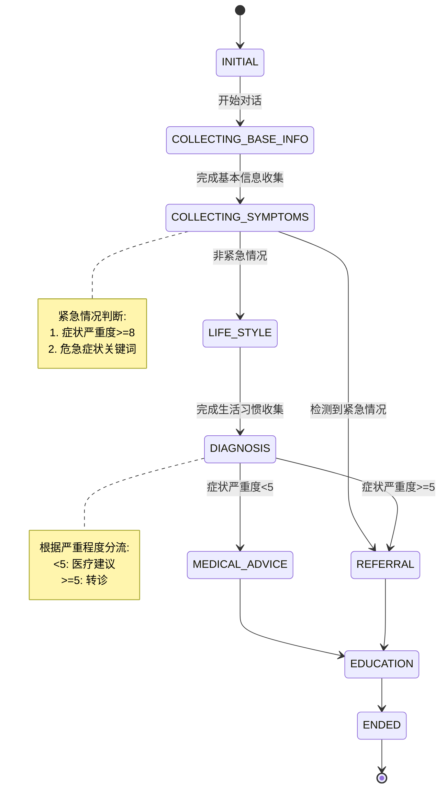

# 医疗问答大模型系统2.0

2.0版本基于LLM的医疗问答系统，集成知识库检索增强生成(RAG)功能，并新增完整的对话管理流程

## 功能特点
- 完整的问诊流程管理
- 智能紧急情况识别
- 基础信息系统性收集
- 症状分析和风险评估
- 分级转诊建议
- 健康教育知识普及
- 知识库检索增强
- 多轮对话支持

## 2.0 系统结构
    medical_LLM_system/
    ├── src/
    │   ├── dialogue/           # 对话管理系统
    │   │   ├── manager.py     # 对话管理器
    │   │   ├── flows.py       # 对话流程实现
    │   │   ├── states.py      # 状态定义
    │   │   └── utils.py       # 工具函数
    │   ├── knowledge/         # 知识库管理
    │   │   └── kb.py          # 知识库实现
    │   ├── llm/              # LLM接口
    │   │   └── api.py         # API实现
    │   └── prompts/          # 提示词配置
    │       └── medical_prompts.py
    ├── data/
    │   ├── knowledge_base/    # 医疗知识源数据
    │   └── vector_store/      # 向量数据
    ├── examples/             # 示例代码
    │   └── main.py           # 主程序示例
    └── test/                 # 测试

## 系统运行逻辑

### 1. 知识库初始化
系统启动时通过init_knowledge_base()函数初始化知识库:
- 若存在已保存的向量索引,直接加载
- 否则从数据源构建新的向量索引并保存

### 2. 问答处理流程

#### 2.1 对话状态流转
系统实现了完整的问诊流程状态机，流程图如下：



系统各状态说明：

1. 初始状态(INITIAL)
2. 基本信息收集(COLLECTING_BASE_INFO)
   - 收集年龄、性别、病史等基本信息
3. 症状信息收集(COLLECTING_SYMPTOMS)
   - 收集主要症状、持续时间、严重程度等
   - **紧急情况判断**：若检测到紧急情况，直接转入转诊流程
4. 生活习惯调查(LIFE_STYLE)
   - 收集作息、饮食、运动等生活习惯
5. 诊断分析(DIAGNOSIS)
   - 基于症状严重程度决定后续流程：
     - 严重程度>=5：转入转诊流程
     - 严重程度<5：转入医疗建议
6. 医疗建议(MEDICAL_ADVICE)
   - 提供用药建议和生活调整方案
7. 转诊建议(REFERRAL)
   - 提供就医科室、等级和注意事项
8. 健康教育(EDUCATION)
   - 提供相关健康知识普及
9. 结束状态(ENDED)

#### 2.2 信息收集和处理
- 每个状态都有对应的Flow类管理信息收集
- 系统按需获取必要信息，避免冗余提问
- 实时检测紧急情况并及时处理
- 结合知识库提供专业建议

#### 2.3 回复生成
系统使用模板化提示词，根据不同状态生成对应回复：
- 诊断模板：分析症状、评估风险
- 医疗建议模板：用药建议、生活调整
- 转诊模板：就医建议、科室推荐
- 健康教育模板：知识普及、预防建议

#### 2.4 多轮对话限制
- 多轮对话伦次和时间设计限制在config.py(未上传)中，保证对话流在合理范围内结束

## 安装依赖
    pip install -r requirements.txt

主要依赖：
- deepseek v3 #LLM api接口
- faiss-cpu #向量数据存储
- sentence-transformers #embedding模型
- langchain #知识库管理
- pandas #数据处理

## 使用方法
```python
from examples.main import init_system

def main():
    # 初始化系统
    manager = init_system()
    print("医疗助手: 您好,我是您的医疗助手。我将按逐步指引您完成问诊流程，接下来会询问您一些基本信息，请回复“开始”（或除“退出”外任何词汇）进行咨询，回复“退出”将离开本次咨询")
    
    # 多轮对话
    while True:
        user_input = input("患者: ").strip()
        if user_input.lower() in ['退出', 'quit', 'exit']:
            break
            
        response = manager.process_message(user_input)
        print(f"医疗助手: {response}")
        
        # 对话结束检查
        if manager.context.state.value == 'ended':
            print("\n对话结束,感谢您的使用\n")
            break

if __name__ == "__main__":
    main()
```

## 2.0 数据集
采用多源医疗数据：
1. 基础问答数据
   - 来源：开源中文医疗问答数据集
   - 数量：内科sample 7644条QA问答
2. 医学教材知识 #暂无
3. 多轮问答语料 #暂无

数据格式示例：

| department	| title | question | answer |
|------------|-------|-----------|---------|
| 内科 | 头痛症状 | 我最近经常头痛，该怎么办？ | 建议您首先记录头痛的具体表现... |

## 测试结果

### 常规诊断建议测试（给出诊断分析，医疗建议，和健康教育）
```
医疗助手： 您好,我是您的医疗助手。我将逐步指引您完成问诊流程，接下来会询问您一些基本信息，请回复“开始”（或除“退出”外任何词汇）进行咨询，回复“退出”将离开本次咨询
患者: 开始
医疗助手: 请问您今年多大年纪了?
患者: 23
医疗助手: 请问您的性别是男士还是女士?
患者: 男
医疗助手: 您之前有没有得过什么病或者动过手术?比如高血压、糖尿病等慢性病,或者做过什么手术?
患者: 无
医疗助手: 您有对什么药物或食物过敏吗?
患者: 盘尼西林
医疗助手: 您目前在吃什么药吗?
患者: 红曲
医疗助手: 能具体说说您哪里不舒服吗?
患者: 胃疼
医疗助手: 这种不舒服大概有多久了?
患者: 2天
医疗助手: 这种不适对您的影响有多大?(1分最轻,10分最重)
患者: 4
医疗助手: 这种不适是持续的,还是时不时才会出现?
患者: 持续
医疗助手: 您观察到什么时候会加重或者减轻吗?
患者: 睡觉会加重
医疗助手: 除了这个症状,还有没有其他不舒服的地方?
患者: 没有
医疗助手: 您最近睡眠怎么样?几点睡觉,一般能睡几个小时?
患者: 12点睡，6个小时
医疗助手: 您平时的饮食习惯是怎样的?
患者: 清淡
医疗助手: 您平时有运动的习惯吗?
患者: 有
医疗助手: 您的工作会不会很累或者压力大?
患者: 累
医疗助手: 您有抽烟喝酒的习惯吗?
患者: 不抽烟喝酒
医疗助手: 已收集到您的信息，正在生成下一阶段建议，输入任意内容继续
患者: 好的
医疗助手: 1. **症状详细分析**：您描述的症状是持续性的胃疼，已经持续了两天，疼痛程度为4（假设1-10的疼痛等级），并且在睡觉时会加重。没有伴随其他明显的症状如恶心、呕吐或腹泻。

2. **可能的病因**：根据您的症状和生活习惯，可能的病因包括胃炎、胃酸过多或胃溃疡。由于您在睡觉时疼痛加重，可能与胃酸在夜间分泌增多有关。此外，工作压力大和睡眠不足也可能加重胃部不适。

3. **疾病风险评估**：虽然您的症状目前没有伴随严重的并发症，但持续的胃疼如果不加以治疗，可能会导致更严重的胃部疾病，如胃溃疡或慢性胃炎。

4. **是否建议就医**：建议您尽快就医，特别是考虑到疼痛已经持续了两天，并且在睡觉时加重。医生可能会建议进行胃镜检查或其他相关检查以确定具体病因，并给予相应的治疗建议。同时，建议您调整生活习惯，保证充足的睡眠，减少工作压力，并继续维持清淡的饮食习惯。
 正在生成下一阶段建议，输入任意内容继续
患者: 继续
医疗助手: 1. 用药注意事项和可能的药物相互作用：
    - 您目前正在使用红曲，这是一种常用于调节血脂的药物。红曲可能与某些药物产生相互作用，特别是他汀类药物，因为它们都作用于胆固醇代谢。由于您对盘尼西林过敏，应避免使用任何含有盘尼西林或其衍生物的药品。在开始任何新药物之前，建议咨询医生或药师，以确保安全。

2. 生活方式调整建议(饮食/运动/作息)：
    - 饮食：继续保持清淡饮食，避免辛辣、油腻和生冷食物，这些可能刺激胃部，加重疼痛。可以尝试少量多餐，避免一次性吃太多。
    - 运动：适量运动有助于改善消化，但避免在饭后立即进行剧烈运动。
    - 作息：尝试调整睡眠时间，保证充足的睡眠，建议每晚至少7-8小时。避免熬夜，尽量在晚上10点前上床睡觉。

3. 需要监测的不良反应：
    - 注意观察是否有胃痛加剧、恶心、呕吐或黑便等症状，这些都可能是胃部问题加重的信号。如果出现这些症状，应立即就医。

4. 是否需要进一步就医：
    - 如果胃痛持续超过两天，或者疼痛程度加重，建议尽快就医。持续的胃痛可能是胃炎、胃溃疡或其他消化系统疾病的表现，需要专业医生的诊断和治疗。
 正在生成下一阶段建议，输入任意内容继续
患者: 继续
医疗助手: 1. **预防和保健建议**：为了预防胃胀痛，建议您避免食用生冷和辛辣的食物，保持饮食的规律性，不要过度饥饿或过饱。同时，保持良好的心情和适量的运动也有助于改善消化功能。

2. **相关健康知识科普**：胃胀痛通常与饮食习惯、情绪压力或消化系统功能紊乱有关。常见的症状包括胃部胀满、疼痛、打嗝或放屁后症状缓解。长期或频繁的胃胀痛可能是胃炎、胃溃疡等消化系统疾病的信号，需要及时就医。

3. **需要警惕的症状**：如果胃胀痛伴随有持续的剧烈疼痛、呕吐、黑便或体重明显下降等症状，应立即就医，这可能是更严重的消化系统疾病的迹象。

4. **日常自我监测建议**：建议您记录下每次胃胀痛的时间、持续时间、疼痛的性质（如刺痛、钝痛等）以及可能的诱因（如食物、情绪等）。这有助于医生更准确地诊断和治疗您的病情。同时，注意观察是否有上述需要警惕的症状出现。
 正在生成下一阶段建议，输入任意内容继续

对话结束,感谢您的使用
```

### 紧急情况测试 （收集症状阶段识别紧急情况，直接进入转诊建议）
```
医疗助手： 您好,我是您的医疗助手。我将逐步指引您完成问诊流程，接下来会询问您一些基本信息，请回复“开始”（或除“退出”外任何词汇）进行咨询，回复“退出”将离开本次咨询
患者: 开始
医疗助手: 请问您今年多大年纪了?
患者: 31
医疗助手: 请问您的性别是男士还是女士?
患者: 男
医疗助手: 您之前有没有得过什么病或者动过手术?比如高血压、糖尿病等慢性病,或者做过什么手术?
患者: 无
医疗助手: 您有对什么药物或食物过敏吗?
患者: 无
医疗助手: 您目前在吃什么药吗?
患者: 盘尼西林
医疗助手: 能具体说说您哪里不舒服吗?
患者: 胃出血
医疗助手: 这种不舒服大概有多久了?
患者: 1天
医疗助手: 这种不适对您的影响有多大?(1分最轻,10分最重)
患者: 10
医疗助手: 1. **就医建议**: 紧急。胃出血是一种严重的医疗状况，需要立即就医。
2. **建议就诊科室**: 消化科或急诊科。
3. **就医等级**: 三级医院。由于胃出血可能涉及复杂的诊断和治疗，建议直接前往设备齐全、专业能力强的三级医院。
4. **就医前准备事项**:
   - 带上所有相关的医疗记录和药物清单。
   - 如果可能，记录下症状的详细情况，包括出血的颜色、量和伴随的其他症状。
   - 避免进食和饮水，直到医生指示可以。
5. **注意事项**:
   - 在就医过程中，保持冷静，尽量详细描述症状和病史。
   - 遵循医生的所有指示，包括可能的检查和治疗。
   - 注意观察症状变化，如有恶化立即通知医护人员。
 正在生成下一阶段建议，输入任意内容继续
患者: 好的
医疗助手: 针对您的胃部不适，我首先想了解的是，您是否有定期进行胃部检查，比如胃镜？这有助于我们更好地了解您的胃部健康状况，并提供更准确的建议。
 正在生成下一阶段建议，输入任意内容继续

对话结束,感谢您的使用
```

### 常规诊断转诊测试（给出诊断分析，转诊建议，和健康教育）
```
医疗助手： 您好,我是您的医疗助手。我将逐步指引您完成问诊流程，接下来会询问您一些基本信息，请回复“开始”（或除“退出”外任何词汇）进行咨询，回复“退出”将离开本次咨询
患者: 你好
医疗助手: 请问您今年多大年纪了?
患者: 25
医疗助手: 请问您的性别是男士还是女士?
患者: 女士
医疗助手: 您之前有没有得过什么病或者动过手术?比如高血压、糖尿病等慢性病,或者做过什么手术?
患者: 无
医疗助手: 您有对什么药物或食物过敏吗?
患者: 无
医疗助手: 您目前在吃什么药吗?
患者: 无
医疗助手: 能具体说说您哪里不舒服吗?
患者: 头疼
医疗助手: 这种不舒服大概有多久了?
患者: 3天
医疗助手: 这种不适对您的影响有多大?(1分最轻,10分最重)
患者: 7
医疗助手: 这种不适是持续的,还是时不时才会出现?
患者: 持续
医疗助手: 您观察到什么时候会加重或者减轻吗?
患者: 无
医疗助手: 除了这个症状,还有没有其他不舒服的地方?
患者: 无
医疗助手: 您最近睡眠怎么样?几点睡觉,一般能睡几个小时?
患者: 12个小时
医疗助手: 您平时的饮食习惯是怎样的?
患者: 清淡
医疗助手: 您平时有运动的习惯吗?
患者: 有
医疗助手: 您的工作会不会很累或者压力大?
患者: 无
医疗助手: 您有抽烟喝酒的习惯吗?
患者: 无
医疗助手: 已收集到您的信息，正在生成下一阶段建议，输入任意内容继续
患者: 1
医疗助手: 1. **症状详细分析**：您描述的症状是持续性的头痛，已经持续了3天，疼痛程度为7（通常疼痛评分范围为0-10，10为最痛）。没有提到头痛的具体位置、性质（如搏动性、压迫性等）或伴随的其他症状（如恶心、视觉变化等）。

2. **可能的病因**：头痛的原因可能包括紧张性头痛、偏头痛、压力或焦虑引起的头痛、睡眠过多或不足、饮食因素等。由于您提到睡眠时间较长（12小时），这可能与头痛有关，因为过长的睡眠时间有时会导致头痛。

3. **疾病风险评估**：根据目前的信息，您的头痛风险较低，但如果头痛持续或加重，或者出现新的症状（如视力问题、言语困难、肢体无力等），则需要考虑更严重的病因，如颅内压增高、脑出血等。

4. **是否建议就医**：建议您首先尝试调整生活习惯，如保持规律的睡眠时间，避免过度睡眠，保持适当的饮食和水分摄入。如果头痛持续不缓解或加重，或者出现上述提到的严重症状，建议尽快就医进行详细检查。

请告诉我，您的头痛是否有特定的触发因素或缓解因素？
 正在生成下一阶段建议，输入任意内容继续
患者: 1
医疗助手: 1. **就医建议**: 非紧急。您的头痛已经持续了3天，虽然疼痛程度较高，但没有伴随其他严重症状，如视力问题、言语障碍或肢体无力等，因此不需要立即急诊处理。

2. **建议就诊科室**: 神经科。由于您的主要症状是头痛，神经科医生能够更专业地评估和处理此类问题。

3. **就医等级**: 二级医院。二级医院通常具备处理此类常见病症的设备和专业医生，同时也能提供较为全面的检查和治疗。

4. **就医前准备事项**:
   - 记录头痛的具体情况，包括开始时间、疼痛程度、是否有缓解或加重的因素。
   - 准备您的健康历史，包括任何已知的过敏史、家族病史等。
   - 带上您目前使用的任何药物或补充剂的清单。

5. **注意事项**:
   - 在就医前，避免使用任何非处方的止痛药物，以免影响医生的诊断。
   - 保持良好的生活习惯，如规律作息、适量运动和健康饮食，有助于缓解头痛。
   - 如果头痛突然加剧或出现新的症状（如视力模糊、言语不清等），应立即就医。
 正在生成下一阶段建议，输入任意内容继续
患者: 1
医疗助手: 1. **预防和保健建议**：
   - 保持规律的作息时间，尽量避免熬夜和过度疲劳。
   - 学习压力管理技巧，如深呼吸、冥想或瑜伽，以减轻工作压力。
   - 定期进行适量的体育活动，如散步或游泳，有助于改善血液循环和减轻头痛。
   - 饮食均衡，避免过多摄入咖啡因和酒精，这些都可能诱发头痛。

2. **相关健康知识科普**：
   - 丛集性头痛是一种严重的头痛类型，通常表现为一侧头部的剧烈疼痛，可能伴有眼红、流泪或鼻塞。这种头痛通常周期性发作，可能持续数周至数月。
   - 孕期头痛可能与荷尔蒙变化、血压波动或脱水有关。孕妇在出现头痛时应及时咨询医生，避免自行用药。

3. **需要警惕的症状**：
   - 头痛伴随视力模糊、言语困难或肢体无力，这可能是中风的征兆，需立即就医。
   - 头痛突然加剧或性质改变，如从钝痛变为剧烈刺痛，应警惕可能的严重疾病。
   - 头痛伴随高热、颈部僵硬或意识改变，可能是脑膜炎的症状，需紧急医疗干预。

4. **日常自我监测建议**：
   - 记录头痛的频率、持续时间、强度及伴随症状，这有助于医生诊断和治疗。
   - 注意头痛的触发因素，如特定食物、环境变化或情绪波动，并尽量避免这些因素。
   - 定期检查血压，特别是对于有高血压病史的患者，以预防与高血压相关的头痛。
 正在生成下一阶段建议，输入任意内容继续

对话结束,感谢您的使用
   ...
```
### 常规诊断转诊测试（给出诊断分析，转诊建议，和健康教育）
```
医疗助手： 您好,我是您的医疗助手。我将逐步指引您完成问诊流程，接下来会询问您一些基本信息，请回复“开始”（或除“退出”外任何词汇）进行咨询，回复“退出”将离开本次咨询
患者: 你好
医疗助手: 对话时间已超时,建议重新开始咨询。

对话结束,感谢您的使用
```

## 未来优化方向
1. 知识库扩充: 扩展专业医疗文献 增加临床案例数据 更新最新医学研究成果 
2. 对话优化: 提升多轮对话准确性 优化问诊路径 增强个性化建议能力 
3. 功能拓展: 添加语音交互功能 支持图片识别功能 接入医疗资源导航
